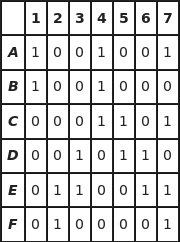

# dlx
> A golang package that uses Dancing Links and Algorithm X to solve the exact cover problem. 


Using this package, you can easily define a matrix which contains 1s and 0s and then pass said matrix into methods which will find either the first solution or all solutions to the exact cover problem for that matrix.

In addition to this, the package provides a simple way to explicitly add rows to a solution as initial conditions. Then, after computing solutions, you can remove them again. This may be useful for efficiently solving many similar problems as it omits the need to rebuild the matrix for each problem.

> More information about [Dancing Links][dancinglinkswiki], [Algorithm X][algorithmxwiki]

## Installation

OS X & Linux:

```sh
$ go get github.com/Kappeh/dlx
```

## Usage example

Here is a very simple example which shows how to utilise the package to construct the following matrix and solve for the subcollection of rows which collectively contain a single 1 in each column.



This particular example can be found [here][example0].

```go
// main.go
package main

import (
	"log"
	"fmt"
	"strings"

	"github.com/Kappeh/dlx"
)

func handleErr(err error) {
	if err != nil {
		log.Fatal(err)
	}
}

func main() {
    // Making new matrix S with 7 primary columns.
	s, err := dlx.New(7, 0)
	handleErr(err)

	// Row0 <- A = {1, 4, 7}
	handleErr(dlx.AddRow(s, 0, 3, 6))
	// Row1 <- B = {1, 4}
	handleErr(dlx.AddRow(s, 0, 3))
	// Row2 <- C = {4, 5, 7}
	handleErr(dlx.AddRow(s, 3, 4, 6))
	// Row3 <- D = {3, 5, 7}
	handleErr(dlx.AddRow(s, 2, 4, 5))
	// Row4 <- E = {2, 3, 6, 7}
	handleErr(dlx.AddRow(s, 1, 2, 5, 6))
	// Row5 <- F = {2, 7}
	handleErr(dlx.AddRow(s, 1, 6))

	count := 0

	// For each solution
	dlx.ForEachSolution(s, func(rows []int) {
		// Covert the row indexes to letters
		letters := make([]string, len(rows))
		for i, v := range rows {
			letters[i] = string("ABCDEF"[v])
		}
		// Combine them in set notation for printing
		setString := "{" + strings.Join(letters, ", ") + "}"
		fmt.Printf("Solution found: %s.\n", setString)
		// Update the solution counter
		count++
	})

	fmt.Printf("Finished. Found %d solution(s).\n", count)
}
```
```
$ go run main.go
Solution found: {B, D, F}.
Finished. Found 1 solution(s).
```

_For more examples and usage, please refer to the [Examples][examples]._

## License

Distributed under the MIT license. See ``LICENSE`` for more information.

<!-- Markdown link & img dfn's -->
[dancinglinkswiki]: https://en.wikipedia.org/wiki/Dancing_Links
[algorithmxwiki]: https://en.wikipedia.org/wiki/Knuth%27s_Algorithm_X
[example0]: https://github.com/Kappeh/dlx/examples/exactCover
[examples]: https://github.com/Kappeh/dlx/examples
