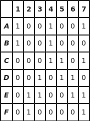

# Exact Cover Example

> More information about the [Exact Cover Problem][exactcoverwiki].

## Problem

The following example will show how to use the dlx package
to solve the exact cover problem for the following:
```
Let S = {A, B, C, D, E, F} be a collection of subsets of a
set X = {1, 2, 3, 4, 5, 6, 7} such that:
A = {1, 4, 7}
B = {1, 4}
C = {4, 5, 7}
D = {3, 5, 6}
E = {2, 3, 6, 7}
F = {2, 7}
```
This can also be represented as the following matrix:



The subcollection ``S* = {B, D, F}`` is the only exact cover
in this case. Our aim is to use the dlx package to
arrive at this conclusion programatically.

---
## Solution
```go
package main

import (
    "github.com/Kappeh/dlx"
)
```
First we need to import the ``dlx`` package.
```go
import (
    "log"
    // Other imports...
)

func main() {
    s, err := dlx.New(7, 0)
    if err != nil {
        log.Fatal(err)
    }

    // More code here...
}
```
Next, we need to actually make our matrix. For our problem we need 7 rows. Each of the columns need to have exactly 1 element in them, therefore they are ``primary`` columns. There is also the option for ``optional`` columns which can contain either 1 or 0 elements in them but we are not going to use them in this example. Therefore we pass in 0 for the ``optional`` parameter.
```go
func main() {
    // Previous code here...

    var err error
    err = dlx.AddRow(s, 0, 3, 6)
    if err != nil {
        log.Fatal(err)
    }
    err = dlx.AddRow(s, 0, 3)
    if err != nil {
        log.Fatal(err)
    }
    err = dlx.AddRow(s, 3, 4, 6)
    if err != nil {
        log.Fatal(err)
    }
    err = dlx.AddRow(s, 2, 4, 5)
    if err != nil {
        log.Fatal(err)
    }
    err = dlx.AddRow(s, 1, 2, 5, 6)
    if err != nil {
        log.Fatal(err)
    }
    err = dlx.AddRow(s, 1, 6)
    if err != nil {
        log.Fatal(err)
    }

    // More code here...
}
```
Next, we add the rows to the matrix. For each row, we pass in the indices of the columns we wish to contain 1s. Remember that indices start at 0, not at 1. To accommodate for this, we have to subtract one from each of the column numbers.
```go
func handleErr(err error) {
    if err != nil {
        log.Fatal(err)
    }
}

func main() {
    s, err := dlx.New(7, 0)
    handleErr(err)

    handleErr(dlx.AddRow(s, 0, 3, 6))
    handleErr(dlx.AddRow(s, 0, 3))
    handleErr(dlx.AddRow(s, 3, 4, 6))
    handleErr(dlx.AddRow(s, 2, 4, 5))
    handleErr(dlx.AddRow(s, 1, 2, 5, 6))
    handleErr(dlx.AddRow(s, 1, 6))

    // More code here...
}
```
Our code is starting to get a little long and repetative due to handling all of these errors. Lets make a small error handling function to reduce this clutter.
```go
import (
    "fmt"
    // Other imports...
)

func main() {
    // Previous code here...

    count := 0

    dlx.ForEachSolution(s, func(s []int) {
    // More code here...

        count++
    })

    fmt.Printf("Finished. Found %d solution(s).\n", count)
}
```
```
$ go run main.go
Finished. Found 1 solution(s).
```
Now that we have our problem set up we can start searching for solutions. Here we are passing in a function to ``ForEachSolution``. The ``dlx`` package will now start finding solutions. Each time a solution is found, the function that we passed into ``ForEachSolution`` will be called. For now, we can simply count the amount of solutions and print it to the console. Great! We've found a solution, but what is it?
```go
import (
    "strings"
    // Other imports...
)

func main() {
    // Previous code here...

    dlx.ForEachSolution(s, func(rows []int) {
        // Covert the row indexes to letters
        letters := make([]string, len(rows))
        for i, v := range rows {
            letters[i] = string("ABCDEF"[v])
        }

        // Combine them in set notation for printing
        setString := "{" + strings.Join(letters, ", ") + "}"
        fmt.Printf("Solution found: %s.\n", setString)

        // Update the solution counter
        count++
    })

    // Previous code here...
}
```
Each time a solution is found, the indices of the rows are passed into our function, in this case ``rows []int``. To display this to the console, first, we make a ``[]string`` called ``letters`` with the same size of the amount of rows. This will hold the letters of the rows. Then, for each row in the solution, we find the corresponding letter and add it to ``letters``. Now we can create our output string, simply joining the elements of ``letters`` and encasing them in curley brackets. Then we print our solution to console.
```
$ go run main.go
Solution found: {B, D, F}.
Finished. Found 1 solution(s).
```
<!-- Markdown link & img dfn's -->
[exactcoverwiki]: https://en.wikipedia.org/wiki/Exact_cover